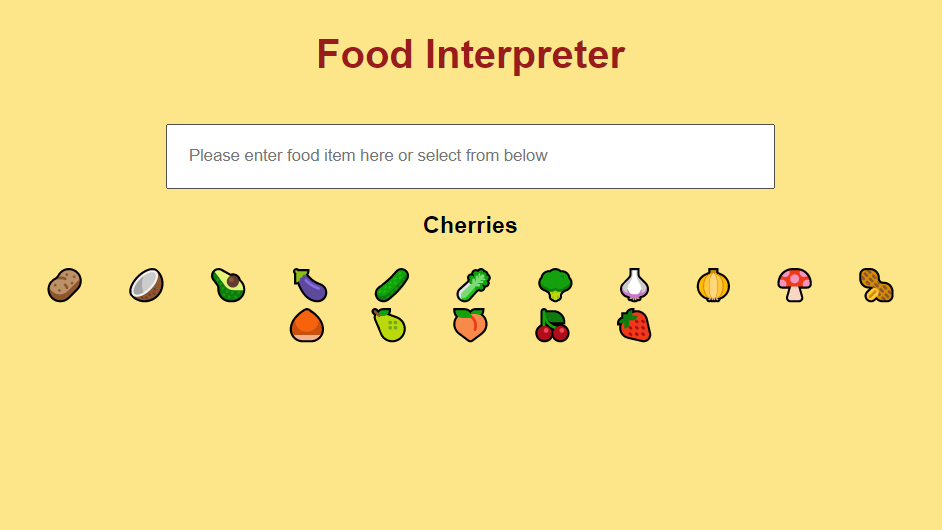

# Food Interpreter

An application built with ReactJS as part of Lesson Five of NeoGcamp Lesson Five. 

Features:
- Search box to search for a food emoticon
- List of food emoticons for user to choose from

View App: [Food Interpreter](http://s3zs5.csb.app/)

## Technologies and Frameworks:
1. ReactJS
2. CSS
3. Codesandbox

<h3>Preview: </h3>

